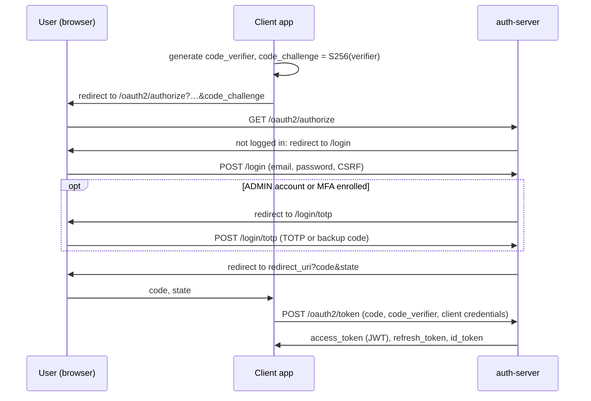

# API guide

Examples assume the server runs on `http://localhost:8080` (see the quick start in the [README](README.md)). Every command below was run against the server; responses are real, shortened where marked with `…`.

The JSON API is also described as OpenAPI: Swagger UI at `/swagger-ui/index.html` and the document at `/v3/api-docs`, both in the `dev` profile only. This guide covers what OpenAPI does not: the OAuth 2.0 / OIDC protocol endpoints and how the pieces fit together.

```bash
B=http://localhost:8080
PW='Str0ng!Passw0rd#2026'
```

## How callers authenticate

| Endpoints                                                                           | Authentication                                                                       |
| ----------------------------------------------------------------------------------- | ------------------------------------------------------------------------------------ |
| `/oauth2/token`, `/oauth2/introspect`, `/oauth2/revoke`                             | OAuth client, HTTP Basic (`client_secret_basic`)                                     |
| `/oauth2/authorize`, `/auth/sessions`, `/login/totp`, `/logout`                     | Browser session (`SESSION` cookie from `/login`), CSRF token on state-changing calls |
| `/userinfo`                                                                         | Bearer access token                                                                  |
| `/auth/me`, `/auth/mfa/*`, `/api/**`                                                | HTTP Basic with the user's email and password                                        |
| `/auth/register`, `/auth/verify`, `/auth/login`, `/auth/password*`, discovery, JWKS | none                                                                                 |

## Errors

API errors share one shape:

```json
{
  "status": 403,
  "message": "MFA enrollment is required for admin accounts",
  "fieldErrors": null,
  "timestamp": "2026-09-30T12:35:35.916569704"
}
```

`fieldErrors` maps field names to messages on validation failures (400). OAuth endpoints use the standard OAuth error format instead, for example `{"error":"invalid_grant"}`.

## Rate limits

| Endpoint                          | Limit         | Key                | If Redis is down |
| --------------------------------- | ------------- | ------------------ | ---------------- |
| `POST /login`, `POST /auth/login` | 5 per 15 min  | IP + username      | 503              |
| same                              | 20 per 15 min | IP                 | 503              |
| `POST /auth/register`             | 3 per hour    | IP                 | request allowed  |
| `POST /oauth2/token`              | 10 per min    | client + IP        | 503              |
| `/api/**`                         | 100 per min   | authenticated user | request allowed  |

Limited responses carry the current window:

```
HTTP/1.1 401
X-RateLimit-Limit: 5
X-RateLimit-Remaining: 4
X-RateLimit-Reset: 900
```

`X-RateLimit-Reset` is in seconds. Over the limit the server answers `429` with `Retry-After`.

## Accounts

Register (the password needs 12+ characters with lower and upper case, a digit and one of `@$!%*?&#`):

```bash
curl -X POST $B/auth/register -H 'Content-Type: application/json' \
  -d '{"email":"alice@example.com","password":"'"$PW"'"}'
```

```json
{
  "id": 1394,
  "email": "alice@example.com",
  "emailVerified": false,
  "createdAt": "2026-09-30T12:34:59.863916"
}
```

No email is sent yet. In the `dev` profile the link appears in the log:

```
DEBUG … UserService : Verification link: /auth/verify?token=406e3dd9-70d3-44be-9ed3-4ae21d5c9784
```

```bash
curl "$B/auth/verify?token=406e3dd9-70d3-44be-9ed3-4ae21d5c9784"
curl -u "alice@example.com:$PW" $B/auth/me
```

`POST /auth/login` only checks credentials and account state; it returns the user and issues no token or session. Tokens come from the OAuth flow below. Five wrong passwords, through any login path, lock the account for 15 minutes (`423`).

Other account endpoints: `PUT /auth/password`, `POST /auth/password-reset-request`, `POST /auth/password-reset`, `PUT /auth/me` (change email). See Swagger UI for their bodies.

## Registering an OAuth client

Needs an ADMIN account (see the README for promoting the first one):

```bash
curl -X POST $B/api/clients -u "admin@example.com:$PW" -H 'Content-Type: application/json' \
  -d '{"clientId":"demo-client","clientName":"Demo Client",
       "redirectUris":["http://127.0.0.1:8081/callback"],"scopes":["openid","profile"]}'
```

```json
{
  "clientId": "demo-client",
  "clientSecret": "d0212014-7b95-4d4b-bae8-64690dd54504"
}
```

The secret is shown once; only its BCrypt hash is stored. Clients are confidential, use `client_secret_basic`, may use `authorization_code` and `refresh_token`, and must use PKCE. `POST /api/admin/clients/{clientId}/rotate-secret` issues a new secret.

```bash
CLIENT_ID=demo-client
CLIENT_SECRET=d0212014-7b95-4d4b-bae8-64690dd54504
REDIRECT_URI=http://127.0.0.1:8081/callback
```

## Authorization code flow with PKCE



A browser does all of this by following redirects. With curl, step by step:

**1. PKCE pair**

```bash
VERIFIER=$(openssl rand -base64 32 | tr '+/' '-_' | tr -d '=')
CHALLENGE=$(printf '%s' "$VERIFIER" | openssl dgst -sha256 -binary | openssl base64 | tr '+/' '-_' | tr -d '=')
```

**2. Log in with the form** (keeps the session in `jar.txt`)

```bash
CSRF=$(curl -s -c jar.txt $B/login | sed -n 's/.*name="_csrf" type="hidden" value="\([^"]*\)".*/\1/p')
curl -s -o /dev/null -b jar.txt -c jar.txt -X POST $B/login \
  --data-urlencode "username=alice@example.com" --data-urlencode "password=$PW" \
  --data-urlencode "_csrf=$CSRF"
```

**3. Authorize**

```bash
REDIRECT=$(curl -s -o /dev/null -w '%{redirect_url}' -b jar.txt \
  "$B/oauth2/authorize?response_type=code&client_id=$CLIENT_ID&redirect_uri=$REDIRECT_URI&scope=openid%20profile&state=xyz&code_challenge=$CHALLENGE&code_challenge_method=S256")
echo "$REDIRECT"
CODE=$(printf '%s' "$REDIRECT" | sed -n 's/.*[?&]code=\([^&]*\).*/\1/p')
```

```
http://127.0.0.1:8081/callback?code=rEVPCt_aUp-znHOfTltnSzoUD20Oco8B…&state=xyz
```

There is no consent screen: clients are registered by an administrator and trusted.

**4. Exchange the code**

```bash
curl -s -u "$CLIENT_ID:$CLIENT_SECRET" $B/oauth2/token \
  -d grant_type=authorization_code --data-urlencode "code=$CODE" \
  -d redirect_uri=$REDIRECT_URI -d "code_verifier=$VERIFIER"
```

```json
{
  "access_token": "eyJraWQiOiIxZjA1Yjc0Yy01Z…",
  "refresh_token": "Wo5NyppB5QslKgakKi7pmiw9g…",
  "scope": "openid profile",
  "id_token": "eyJraWQiOiIxZjA1Yjc0Yy01Z…",
  "token_type": "Bearer",
  "expires_in": 899
}
```

The access token is an RS256 JWT, valid for 15 minutes. Its payload:

```json
{
  "sub": "alice@example.com",
  "aud": "demo-client",
  "scope": ["openid", "profile"],
  "roles": ["USER"],
  "permissions": [],
  "iss": "http://localhost:8080",
  "iat": 1790771718,
  "nbf": 1790771718,
  "exp": 1790772618,
  "jti": "95012259-48b2-472f-98ba-8d042b803612"
}
```

`roles` and `permissions` let a resource server authorize requests without calling back.

A code works once, only for the client it was issued to, only with the matching `code_verifier` and `redirect_uri`. An unregistered `redirect_uri` is answered with 400 and never redirected to.

## Using and managing tokens

Validate locally with the keys from `/oauth2/jwks`, or ask the server:

```bash
curl -u "$CLIENT_ID:$CLIENT_SECRET" $B/oauth2/introspect -d "token=$ACCESS_TOKEN"
```

```json
{"active":true,"sub":"alice@example.com","aud":["demo-client"],"scope":"openid profile",
 "roles":["USER"],"permissions":[],"client_id":"demo-client","token_type":"Bearer",…}
```

OIDC user info:

```bash
curl -H "Authorization: Bearer $ACCESS_TOKEN" $B/userinfo
```

```json
{ "sub": "alice@example.com" }
```

Refresh (valid 7 days). Every refresh returns a new refresh token and invalidates the previous one; presenting an old refresh token again fails:

```bash
curl -u "$CLIENT_ID:$CLIENT_SECRET" $B/oauth2/token -d grant_type=refresh_token -d "refresh_token=$REFRESH_TOKEN"
```

```json
{ "error": "invalid_grant" }
```

After a refresh the previous access token is also reported inactive by `/oauth2/introspect` and rejected by `/userinfo`. A resource server that only checks the JWT signature keeps accepting it until it expires.

Revoke (access or refresh token):

```bash
curl -u "$CLIENT_ID:$CLIENT_SECRET" $B/oauth2/revoke -d "token=$ACCESS_TOKEN"   # 200
curl -u "$CLIENT_ID:$CLIENT_SECRET" $B/oauth2/introspect -d "token=$ACCESS_TOKEN"
```

```json
{ "active": false }
```

Discovery and keys:

```bash
curl $B/.well-known/openid-configuration
curl $B/oauth2/jwks
```

The discovery document lists every grant type Spring Authorization Server supports; what a client may actually use is limited by its registration (`authorization_code` and `refresh_token`).

## MFA

Enroll (HTTP Basic):

```bash
curl -X POST -u "alice@example.com:$PW" $B/auth/mfa/enable   # otpauthUri, manualEntryKey, qrCodeDataUri
curl -u "alice@example.com:$PW" $B/auth/mfa/qr -o qr.png     # the same QR code as a PNG file
curl -X POST -u "alice@example.com:$PW" $B/auth/mfa/verify-setup \
  -H 'Content-Type: application/json' -d '{"code":"123456"}'          # returns 10 backup codes
```

MFA is enforced at `/oauth2/authorize` for every account that enrolled, from its next sign-in: after the password step the browser is sent to `/login/totp`, which accepts a TOTP code or a backup code. For ADMIN accounts it is mandatory; an ADMIN who has not enrolled gets:

```json
{"status":403,"message":"MFA enrollment is required for admin accounts",…}
```

`POST /auth/mfa/disable` with the account password turns it off. See [SECURITY.md](SECURITY.md) for the scope of MFA enforcement.

## Sessions

Signed-in browser sessions live in Redis. With the session cookie from `/login`:

```bash
curl -b jar.txt $B/auth/sessions
```

```json
[
  {
    "id": "67e224e735a09c41849d0722f51a23158d476c150e7e190b0b191c56b8a47da8",
    "current": true,
    "ipAddress": "192.168.97.1",
    "userAgent": "curl/8.7.1",
    "createdAt": "2026-09-30T12:35:17.985Z",
    "lastAccessedAt": "2026-09-30T12:35:35.935Z"
  }
]
```

`id` is a SHA-256 hash of the session id. `DELETE /auth/sessions/{id}` revokes one session, `DELETE /auth/sessions` all but the current one; both need the CSRF token.

## Admin API

HTTP Basic with an account that has the listed authority. ADMIN has all of them, AUDITOR has `AUDIT_READ`.

| Endpoint                                                                   | Authority       |
| -------------------------------------------------------------------------- | --------------- |
| `GET /api/admin/users?query=&page=&size=&sort=`                            | `USER_READ`     |
| `GET /api/admin/users/{id}`                                                | `USER_READ`     |
| `PUT /api/admin/users/{id}/disable`                                        | `USER_WRITE`    |
| `DELETE /api/admin/users/{id}`                                             | `USER_WRITE`    |
| `POST /api/admin/users/{id}/force-logout`                                  | `USER_WRITE`    |
| `GET /api/admin/sessions`                                                  | `USER_READ`     |
| `GET /api/admin/metrics`                                                   | `USER_READ`     |
| `GET /api/admin/audit?userId=&action=&from=&to=`                           | `AUDIT_READ`    |
| `POST /api/clients`                                                        | role ADMIN      |
| `GET, PUT, DELETE /api/admin/clients/{clientId}`, `GET /api/admin/clients` | `CLIENT_MANAGE` |
| `POST /api/admin/clients/{clientId}/rotate-secret`                         | `CLIENT_MANAGE` |

```bash
curl -u "admin@example.com:$PW" "$B/api/admin/users?query=example&size=5&sort=email,asc"
curl -u "admin@example.com:$PW" "$B/api/admin/audit?action=LOGIN_FAILED"
curl -u "admin@example.com:$PW" $B/api/admin/metrics
```

Admins cannot disable or delete themselves (`409`). Disabling or deleting a user ends all of that user's sessions. Every change is written to the audit log.
