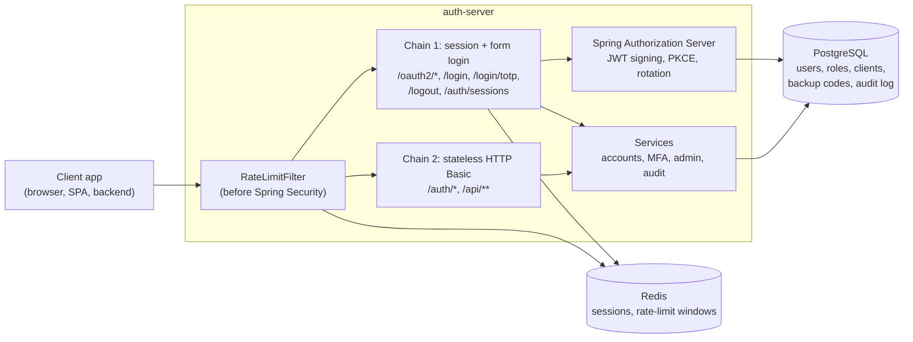

# auth-server

An OAuth 2.0 / OpenID Connect authorization server with multi-factor authentication, built from scratch on Spring Boot 4 and Spring Authorization Server. A portfolio project in the space of Auth0, Okta and Keycloak: small enough to read end to end, strict enough to take security seriously.


## Features

- **OAuth 2.0 + OIDC**: authorization code flow with mandatory PKCE, refresh token rotation with reuse detection, token introspection and revocation, OIDC discovery, JWKS, RS256-signed JWT access tokens that carry roles and permissions
- **Accounts**: registration with email verification, password policy, password change and reset, account lockout after 5 failed attempts across every login path
- **MFA**: TOTP (RFC 6238) with QR enrollment, 10 single-use backup codes, secrets encrypted with AES-256-GCM, replay protection. Required before any token is issued for every account that enrolled, and mandatory for administrators
- **RBAC**: roles (ADMIN, USER, DEVELOPER, AUDITOR) mapped to permissions, enforced at URL and method level
- **Sessions**: stored in Redis, so they survive restarts; users can list and revoke their own sessions, admins can force a logout
- **Audit log**: append-only at the database level (UPDATE/DELETE revoked from the application role), queryable by admins and auditors
- **Rate limiting**: sliding-window limiter in Redis (atomic Lua script) on login, registration, token and API endpoints, with `X-RateLimit-*` headers
- **Admin API**: users, OAuth clients, sessions, metrics
- **Operations**: multi-stage Docker image, dev/prod profiles, liveness and readiness probes, graceful shutdown, trusted-proxy handling, log masking of secrets in production

## Stack

Java 17 · Spring Boot 4.1 · Spring Security 7 · Spring Authorization Server · PostgreSQL 15 + Flyway · Redis 7 + Spring Session · Testcontainers · JaCoCo · springdoc-openapi · Docker

## Architecture



Two Spring Security filter chains split the server by how callers authenticate:

- **Chain 1** serves the OAuth/OIDC protocol and anything that relies on the browser session: form login, the TOTP step, logout and session management. CSRF protection is on.
- **Chain 2** is stateless and serves the JSON API with HTTP Basic. The per-user API rate limit runs inside it, after authentication, so it can key on the real principal.

Rate limiting for the unauthenticated endpoints runs before both chains, so requests that Spring Security would reject are still counted.

## Quick start

Requirements: Docker. For running outside Docker: JDK 17.

```bash
cp .env.example .env
```

Fill in `.env`, for example:

```dotenv
DB_NAME=authdb
DB_USER=authuser
DB_PASSWORD=change-me
DB_PORT=5432
APP_PORT=8080
REDIS_HOST=localhost
REDIS_PORT=6379
MFA_ENCRYPTION_KEY=<output of: openssl rand -base64 32>
```

Start the whole stack (PostgreSQL, Redis and the server):

```bash
APP_PROFILE=dev docker compose --profile app up -d --build
curl http://localhost:8080/actuator/health/readiness
```

The `dev` profile is used here because the server does not send emails yet: verification and password reset links are written to the log at DEBUG level, which only the `dev` profile enables. It also turns on Swagger UI. Without `APP_PROFILE` the container runs the `prod` profile.

Register, verify and look at yourself:

```bash
curl -X POST http://localhost:8080/auth/register \
  -H 'Content-Type: application/json' \
  -d '{"email":"admin@example.com","password":"Str0ng!Passw0rd#2026"}'

docker compose logs app | grep 'Verification link'
curl "http://localhost:8080/auth/verify?token=<token from the log>"

curl -u 'admin@example.com:Str0ng!Passw0rd#2026' http://localhost:8080/auth/me
```

There is no admin bootstrap endpoint on purpose. Promote the first administrator in the database:

```bash
docker compose exec postgres psql -U authuser -d authdb -c \
  "INSERT INTO user_roles (user_id, role_id)
   SELECT u.id, r.id FROM users u, roles r
   WHERE u.email = 'admin@example.com' AND r.name = 'ADMIN'"
```

From here, [API.md](API.md) walks through registering an OAuth client and running the full authorization code + PKCE flow with curl.

### Running from source

```bash
docker compose up -d   # PostgreSQL and Redis only
./run-dev.sh           # loads .env, activates the dev profile, starts the server
```

- Swagger UI: http://localhost:8080/swagger-ui/index.html (dev profile only)
- OpenAPI document: http://localhost:8080/v3/api-docs
- An Insomnia collection with every request is in [`insomnia/`](insomnia/)

## Tests

```bash
./mvnw test
```

No local setup is needed: Testcontainers starts disposable PostgreSQL and Redis containers for the run. The suite covers the full OAuth flow end to end (including attacks such as code reuse, PKCE mismatch, redirect URI substitution and forged JWTs), a guard that walks every `/api/**` endpoint as an anonymous and an unprivileged user, SQL injection attempts, account lockout on the real database, rate limiting against real Redis and the failure policy when Redis is down.

JaCoCo fails the build if any service class drops below 80% line coverage. The report is written to `target/site/jacoco/index.html`.

With OrbStack or another non-default Docker socket, point Testcontainers at it, for example `export DOCKER_HOST=unix://$HOME/.orbstack/run/docker.sock`.

## Configuration

| Variable                                                  | Default                        | Purpose                                                                    |
| --------------------------------------------------------- | ------------------------------ | -------------------------------------------------------------------------- |
| `DB_HOST`, `DB_PORT`, `DB_NAME`, `DB_USER`, `DB_PASSWORD` | host `localhost`               | PostgreSQL connection                                                      |
| `REDIS_HOST`, `REDIS_PORT`                                |                                | Redis connection                                                           |
| `APP_PORT`                                                |                                | HTTP port                                                                  |
| `MFA_ENCRYPTION_KEY`                                      |                                | Base64 of exactly 32 random bytes, encrypts TOTP secrets                   |
| `APP_ISSUER_URI`                                          | `http://localhost:${APP_PORT}` | OAuth/OIDC issuer; must be the public URL in production                    |
| `APP_CORS_ALLOWED_ORIGINS`                                | none                           | Comma-separated origins allowed to call the server from a browser          |
| `TRUSTED_PROXIES`                                         | loopback                       | Regex of proxy addresses whose `X-Forwarded-For` is trusted (prod profile) |
| `SHUTDOWN_TIMEOUT`                                        | `30s`                          | Time given to in-flight requests on shutdown                               |
| `SPRING_PROFILES_ACTIVE`                                  | none (`prod` in the image)     | `dev` or `prod`                                                            |
| `APP_PROFILE`                                             | `prod`                         | Profile for the compose `app` service                                      |

Rate limits can be tuned with `app.rate-limit.<login|login-ip|register|token|api>.limit` and `.window`.

## Documentation

- [API.md](API.md): the OAuth flow and every endpoint group, with curl examples
- [SECURITY.md](SECURITY.md): security design decisions and known limitations
- Swagger UI in the dev profile for the JSON API

## Project layout

```text
src/main/java/com/sozureke/auth_server/
  admin/       admin API: users, clients, sessions, metrics
  audit/       audit log, query API, auditing handlers
  auth/        credential checks, lockout, password flows
  config/      security chains, authorization server, CORS, OpenAPI, errors
  logging/     production log masking
  mfa/         TOTP, backup codes, secret encryption, the /login/totp step
  oauth/       client registration and persistence for Spring Authorization Server
  ratelimit/   Redis sliding-window limiter and filters
  role/        roles and permissions
  session/     Redis sessions and self-service session management
  user/        registration, verification, password policy
src/main/resources/
  db/migration/   Flyway migrations
  redis/          rate limiter Lua script
scripts/          audit log retention job
```
